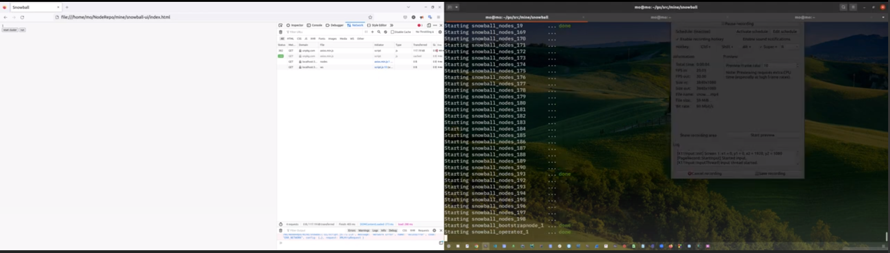

# Snowball

My implementation for avalanche or snowball consensus following **[this blog](https://docs.avax.network/overview/getting-started/avalanche-consensus)** (or **[this whitepaper](https://www.avalabs.org/whitepapers)**)

# Demo

[](https://youtu.be/3xokRzrW8IQ)

# UI

UI for this repo is [snowball-ui](https://github.com/kanguki/snowball-ui), just open the index.html file on browser

# How to run

```sh
docker-compose build
docker-compose --compatibility up
```

# Dev note

Change the cluster configuration in **[docker-compose.yml](docker-compose.yml)** file for your reference :)

If replicas is big, `B`, `timeout_loop`, `timeout_query` should be increased, i.e. change these parameters: ` -K=7 -A=4 -B=50 -timeout_loop=60 -timeout_query=5`
